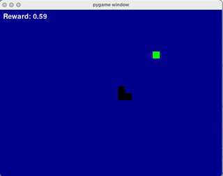
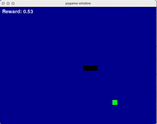
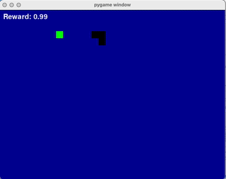
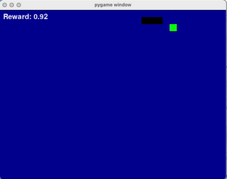

# Gym-Style Snake Environment

A classic Snake game implemented as a Gym environment, ready for use with any RL library (e.g., Stable Baselines3, RLlib, or your own PPO implementation).

## Demonstration of learning: 

Here the demos of differnt stages of learning of the snake in the consequtive order (with some time between)

<p float="left">
  
  
  
  
</p>

(code for training and parameters of best model would be uploaded soon)

## Features

- Fully Gym-compatible: Use with any Gym-based RL agent.
- Customizable: Set the length of the "awareness" (how much of the snake's body is included in the state).
- Optional modifier: Disallow moving backwards for faster learning. 
- Pygame rendering: Visualize the agent's performance.

## Installation

```bash
pip install pygame gym numpy
```

## Optional: Training Demo

To run the training demo in `gym_style_snake.py` (which uses Stable Baselines3), you'll also need:

```bash
pip install stable-baselines3
```


## Usage

### As a standalone environment

```python
from gym_style_snake import GymStyleSnake

env = GymStyleSnake(aware_length=10)#, disallow_backwards=True
obs, info = env.reset()
model = PPO("MlpPolicy", env, verbose=1)
done = False
while not done:
    action = env.action_space.sample()
    obs, reward, terminated, truncated, info = env.step(action)
    env.render()
    done = terminated or truncated
env.close()
```

### With Stable Baselines3

```python
from stable_baselines3 import PPO
from gym_style_snake import GymStyleSnake

env = GymStyleSnake(aware_length=10)#, disallow_backwards=True
model = PPO("MlpPolicy", env, verbose=1)
model.learn(total_timesteps=10000)
```

## Arguments

- `aware_length` (int): How many body segments to include in the state.
- `disallow_backwards` (bool): If `True`, the snake cannot move directly backwards (recommended for RL). -- to be added soon


## Acknowledgements

- Built with Pygame and Gym.
